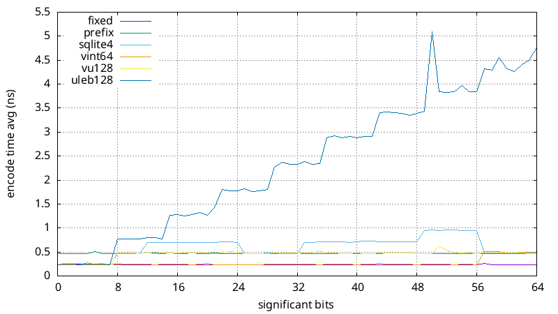

Reimplements and benchmarks some varint algorithms mentionned in the conversation following the [VU128 blog post](https://john-millikin.com/vu128-efficient-variable-length-integers):
- https://news.ycombinator.com/item?id=40426666
- https://lobste.rs/s/qvoe7a/vu128_efficient_variable_length
- https://www.reddit.com/r/programming/comments/1cxd0y2/vu128_efficient_variablelength_integers/

Implementation rules/constraints/exceptations:

- Allowed to write more than the actual encoded length
- Allowed to read more than the actual encoded length
- Encode buffer was memset to 0
- Should support all int sizes from u8 up to at minimum u64
- Decode input is considered trustable and compliant

Current implementation are probably not optimal and pull requests are welcome.

Below results are for encoding all 2^x-1 from x=0 to 64 included:

| Format                                                                          |     Size(B) |  Encode(ns) |  Decode(ns) |
| ------------------------------------------------------------------------------- | ----------- | ----------- | ----------- |
| Fixed: fixed size read/write                                                    |      8.0000 |      0.2376 |      0.9360 |
| Prefix: u8 prefix announcing size                                               |      5.4462 |      0.4723 |      0.9383 |
| [SQLite4](https://sqlite.org/src4/doc/trunk/www/varint.wiki)                    |      5.2769 |      0.6080 |      1.1067 |
| [ULEB128](https://en.wikipedia.org/wiki/LEB128)                                 |      5.0154 |      2.3554 |      4.9586 |
| [vint64](https://github.com/iqlusioninc/veriform/tree/develop/rust/vint64/)     |    *5.0000* |    *0.2735* |      1.1628 |
| [vu128](https://john-millikin.com/vu128-efficient-variable-length-integers)     |      5.3231 |      0.4524 |    *0.9526* |

And here are detailed graphs for each 2^x-1 value:

Here's the encode/decode graphs again, without uleb128:

